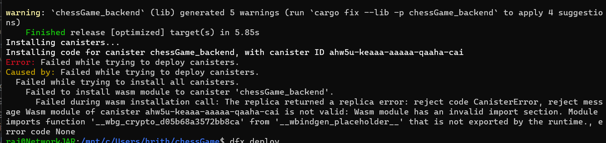

# Chopsticks

This is not a chess game but a chopsticks game. I am really still in an error and cant resolve it yet



Chopsticks is a hand game played in past time


Rules:
Each player starts with one finger pointed out on each of their hands.
Players take turns to tap one hand against another hand (either their own or their opponent's) to "transfer" fingers.
When tapping another player's hand, the number of fingers on the tapping hand is added to the tapped hand. For example, if a player with 1 finger extended on their hand taps an opponent's hand with 2 fingers extended, the opponent's hand now has 3 fingers extended.
If a player's hand reaches exactly 5 fingers, that hand is considered "dead" or out of the game, and it must be put behind the player's back or closed into a fist.
If tapping one of their own hands with the other, the total number of fingers is distributed evenly between the two hands if possible. If the sum is odd, the player can choose how to distribute the fingers.
The goal is to force both of the opponent's hands out of the game.
Winning:
A player wins by making both of the opponent's hands reach 5 fingers and thus become "dead".

Welcome to your new chessGame project and to the internet computer development community. By default, creating a new project adds this README and some template files to your project directory. You can edit these template files to customize your project and to include your own code to speed up the development cycle.

To get started, you might want to explore the project directory structure and the default configuration file. Working with this project in your development environment will not affect any production deployment or identity tokens.

To learn more before you start working with chessGame, see the following documentation available online:

- [Quick Start](https://internetcomputer.org/docs/current/developer-docs/setup/deploy-locally)
- [SDK Developer Tools](https://internetcomputer.org/docs/current/developer-docs/setup/install)
- [Rust Canister Development Guide](https://internetcomputer.org/docs/current/developer-docs/backend/rust/)
- [ic-cdk](https://docs.rs/ic-cdk)
- [ic-cdk-macros](https://docs.rs/ic-cdk-macros)
- [Candid Introduction](https://internetcomputer.org/docs/current/developer-docs/backend/candid/)

If you want to start working on your project right away, you might want to try the following commands:

```bash
cd chessGame/
dfx help
dfx canister --help
```

## Running the project locally

If you want to test your project locally, you can use the following commands:

```bash
# Starts the replica, running in the background
dfx start --background

# Deploys your canisters to the replica and generates your candid interface
dfx deploy
```

Once the job completes, your application will be available at `http://localhost:4943?canisterId={asset_canister_id}`.

If you have made changes to your backend canister, you can generate a new candid interface with

```bash
npm run generate
```

at any time. This is recommended before starting the frontend development server, and will be run automatically any time you run `dfx deploy`.

If you are making frontend changes, you can start a development server with

```bash
npm start
```

Which will start a server at `http://localhost:8080`, proxying API requests to the replica at port 4943.

### Note on frontend environment variables

If you are hosting frontend code somewhere without using DFX, you may need to make one of the following adjustments to ensure your project does not fetch the root key in production:

- set`DFX_NETWORK` to `ic` if you are using Webpack
- use your own preferred method to replace `process.env.DFX_NETWORK` in the autogenerated declarations
  - Setting `canisters -> {asset_canister_id} -> declarations -> env_override to a string` in `dfx.json` will replace `process.env.DFX_NETWORK` with the string in the autogenerated declarations
- Write your own `createActor` constructor
